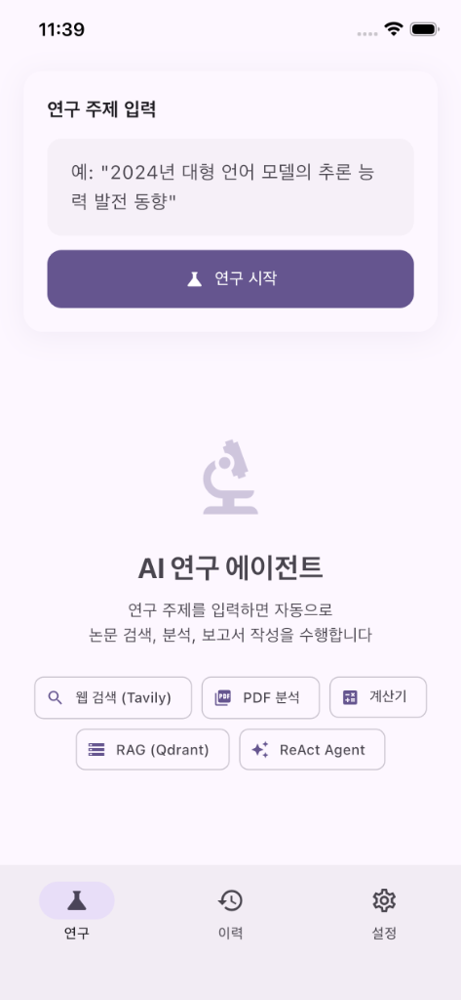
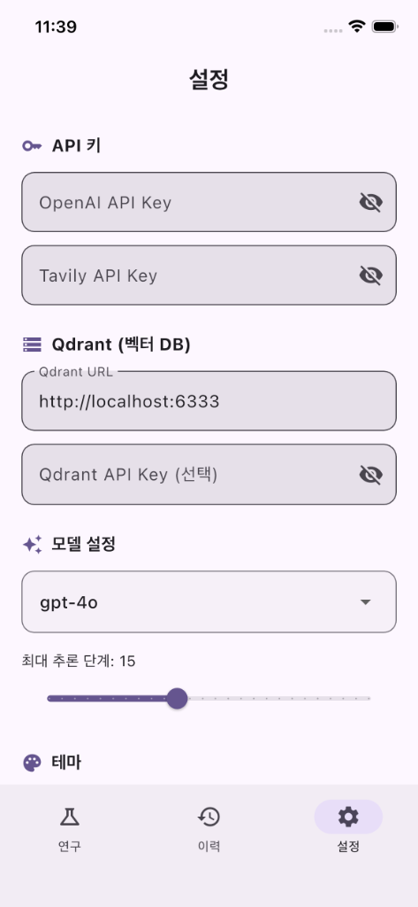
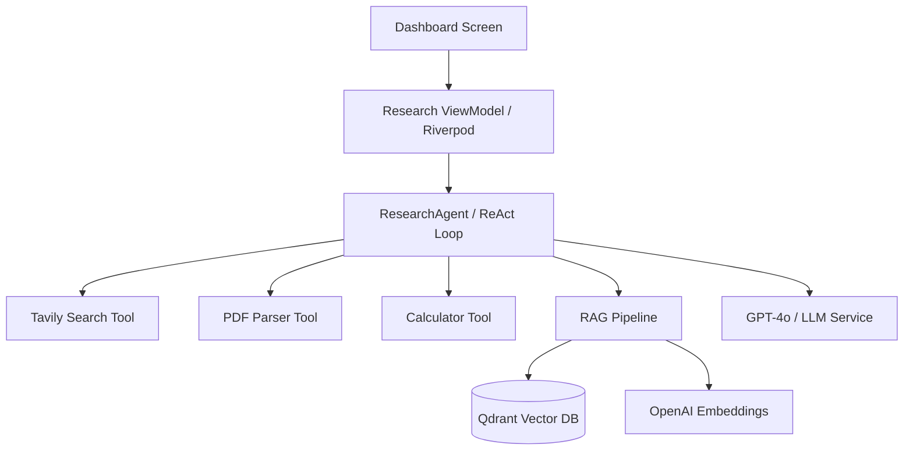

#  ResearchArch

**자율적 AI 연구 에이전트** - 사용자의 연구 주제를 바탕으로 스스로 자료를 찾고 분석하여 전문적인 보고서를 작성합니다.

<p align="center">
  
  
  
  
  
  
</p>

---

## 🌟 개요 (Overview)

**ResearchArch**는 **ReAct (Reasoning + Acting)** 프레임워크를 탑재한 자율형 연구 도우미입니다. 단순한 채팅 AI를 넘어, 에이전트가 직접 웹 검색, PDF 문서 분석, 벡터 DB(RAG) 검색을 조합하여 최신 정보를 수집하고 논리적인 보고서를 생성합니다.

- **스스로 생각하고 행동**: ReAct 루프를 통해 단계별로 무엇을 조사해야 할지 결정합니다.
- **실시간 투명성**: 연구가 진행되는 과정을 타임라인 형태로 실시간 관찰할 수 있습니다.
- **근거 기반 보고서**: 모든 분석 결과는 출처가 포함된 정돈된 마크다운 보고서로 제공됩니다.

---

## 📸 스크린샷 (Screenshots)

사용자 인터페이스의 주요 화면들입니다.

| 연구 (Research) | 이력 (History) | 설정 (Settings) |
|:---:|:---:|:---:|
|  |  |  |

## 핵심 기능 (Key Features)

- 🔍 **고급 웹 검색 (Tavily)**: 수천 개의 웹 페이지 중 가장 신뢰도 높은 연구 정보를 우선 추출합니다.
- 📄 **지능형 PDF 분석**: 원격 URL이나 로컬 PDF의 내용을 자동으로 파싱하고 이해합니다.
- ⚡ **RAG 파이프라인**: Qdrant 벡터 데이터베이스와 OpenAI Embeddings를 활용한 고성능 지식 검색 시스템.
- 📐 **수학적 정확도**: 계산기 도구를 내장하여 복잡한 수치 분석 결과의 정확성을 보장합니다.
- 📜 **영구 이력 관리**: 과거에 진행했던 모든 연구 결과와 보고서를 한눈에 관리하고 다시 열람할 수 있습니다.
- 🌓 **다이내믹 디자인**: 사용자 경험을 고려한 미려한 UI와 다크/라이트 모드 지원.

---

## 🏗️ 아키텍처 (Architecture)

시스템은 견고한 모듈형 구조를 갖추고 있으며, 비즈니스 로직과 UI가 명확히 분리되어 있습니다.



- **LangChain.dart**: 에이전트 루프 및 도구(Tools) 추상화 계층.
- **Riverpod**: 전역 상태 관리 및 UI 동기화.
- **HNSW Indexing**: 벡터 검색의 속도와 정확도를 위한 고급 인덱싱 기술.

---

## 🛠️ 시작하기 (Getting Started)

### 사전 요구 사항
- **Flutter SDK**: 3.41 이상
- **API Keys**: OpenAI, Tavily
- **Database**: Qdrant (Docker를 통한 로컬 실행 권장)

### 1단계: 저장소 복제 및 설치
```bash
git clone https://github.com/kimdzhekhon/Research_Arch.git
cd Research_Arch
flutter pub get
```

### 2단계: Qdrant 실행 (Docker)
```bash
docker run -d --name qdrant \
  -p 6333:6333 -p 6334:6334 \
  -v qdrant_storage:/qdrant/storage \
  qdrant/qdrant
```

### 3단계: 환경 변수와 함께 앱 실행
환경 변수를 `--dart-define`으로 주입하거나 앱의 환경 설정 화면에서 직접 입력할 수 있습니다.
```bash
flutter run \
  --dart-define=OPENAI_API_KEY=your_key \
  --dart-define=TAVILY_API_KEY=your_key
```

---

## 📦 기술 스택 (Tech Stack)

- **Framework**: Flutter / Dart
- **AI Agent**: LangChain.dart
- **Intelligence**: GPT-4o
- **Embeddings**: text-embedding-3-small
- **Vector Store**: Qdrant
- **State Management**: Riverpod (v2.6+)
- **Storage**: Shared Preferences
- **UI Components**: Shimmer, Animated Text Kit, Google Fonts

---

<br>

# 🌐 English Version

# ResearchArch

**Autonomous AI Research Agent** - An intelligent assistant that searches, analyzes, and writes professional research reports based on your topics.

---

## 🚀 Overview
**ResearchArch** is an autonomous research assistant powered by the **ReAct (Reasoning + Acting)** framework. Unlike simple chat interfaces, it autonomously decides which tools to use—web search, PDF analysis, or RAG-based knowledge retrieval—to deliver comprehensive, source-backed reports.

### Key Capabilities
- **Reasoning Loop**: Uses the ReAct engine to strategically plan and execute its research steps.
- **Real-time Visibility**: Monitor the agent's "Thought-Action-Observation" process through a live timeline.
- **Precision Reporting**: Generates structured Markdown reports with citations and evidence.

---

## ✨ Features
- 🔍 **Smart Web Search**: Powered by Tavily API to filter high-quality research from thousands of sources.
- 📄 **Deep PDF Parsing**: Automatically extracts and understands content from online and local documents.
- ⚡ **RAG Integration**: High-speed semantic search using Qdrant HNSW indexing and OpenAI embeddings.
- 📐 **Inbuilt Calculator**: Ensures mathematical accuracy for complex numerical reasoning tasks.
- 📜 **Research History**: Save and manage all your past reports for future reference.
- 🌓 **Premium UX**: Modern, reactive UI with full support for light and dark modes.

---

## 🏗️ Architecture
The project follows a clean, modular architecture decoupled from the UI:
- **Presentation**: Riverpod-based ViewModels for seamless state management.
- **Intelligence**: ReAct loop engine managing tools and observations.
- **Services**: Abstracted layers for LLM, Embeddings, and Networking.

---

## 🛠️ Usage & Setup
1. **Clone**: `git clone [repository_url]`
2. **Setup DB**: Run Qdrant via Docker (`p 6333:6333`).
3. **Configure**: Enter your OpenAI and Tavily API keys in the app settings or via CLI.
4. **Research**: Enter any topic and watch the agent work its magic!

---

## 📄 License
MIT License - Copyright (c) 2026

---

## 👥 Contributors
- **kimdzhekhon** (Main Developer)

---

> Created with passion for AI Research & Architecture.
